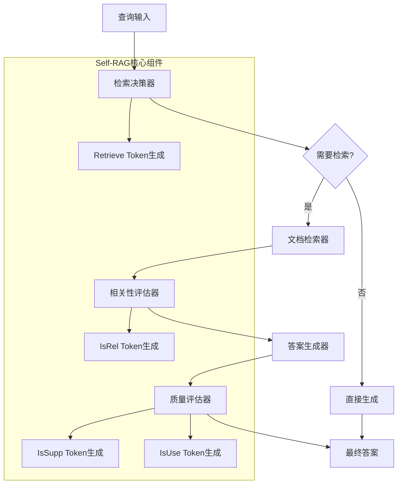

# 🔧 Self-RAG检索决策模块实现方案

## 🎯 设计目标

实现一个**基于规则的Self-RAG系统**，保持核心算法思想的同时避免大规模训练需求。

## 🏗️ 整体架构设计

### **1. 模块组件架构**



### **2. 数据流设计**

```python
class SelfRAGFlow:
    """Self-RAG数据流"""
    
    def process_query(self, query: str) -> SelfRAGResult:
        # 1. 检索决策
        retrieve_decision = self.retrieval_decider.decide(query)
        
        if retrieve_decision.should_retrieve:
            # 2. 文档检索
            documents = self.retriever.retrieve(query)
            
            # 3. 相关性评估
            relevant_docs = self.relevance_evaluator.filter(query, documents)
            
            # 4. 答案生成
            answer = self.generator.generate(query, relevant_docs)
            
            # 5. 质量评估
            quality_assessment = self.quality_evaluator.evaluate(
                query, relevant_docs, answer
            )
        else:
            # 直接生成
            answer = self.generator.generate(query, [])
            quality_assessment = self.quality_evaluator.evaluate(query, [], answer)
        
        return SelfRAGResult(
            query=query,
            retrieve_decision=retrieve_decision,
            documents=documents,
            answer=answer,
            quality_assessment=quality_assessment
        )
```

## 🧠 核心组件设计

### **1. 检索决策器 (Retrieval Decider)**

#### **1.1 决策规则设计**

```python
class RetrievalDecider:
    """检索决策器"""
    
    def __init__(self):
        self.decision_rules = {
            'factual_keywords': [
                'what is', 'who is', 'when did', 'where is',
                'how many', 'which', 'define', 'explain'
            ],
            'complex_patterns': [
                r'compare.*with', r'difference between',
                r'advantages.*disadvantages', r'pros.*cons'
            ],
            'knowledge_domains': [
                'history', 'science', 'technology', 'medicine',
                'law', 'economics', 'politics'
            ]
        }
    
    def decide(self, query: str) -> RetrievalDecision:
        """决定是否需要检索"""
        
        # 1. 事实性查询检测
        factual_score = self._detect_factual_query(query)
        
        # 2. 复杂度评估
        complexity_score = self._assess_complexity(query)
        
        # 3. 知识需求评估
        knowledge_score = self._assess_knowledge_need(query)
        
        # 4. 综合决策
        decision_score = (
            0.4 * factual_score +
            0.3 * complexity_score +
            0.3 * knowledge_score
        )
        
        should_retrieve = decision_score > 0.6
        
        return RetrievalDecision(
            should_retrieve=should_retrieve,
            confidence=decision_score,
            reasoning=self._generate_reasoning(factual_score, complexity_score, knowledge_score),
            token="[Retrieve]" if should_retrieve else "[No Retrieve]"
        )
```

#### **1.2 决策特征提取**

```python
def _detect_factual_query(self, query: str) -> float:
    """检测事实性查询"""
    query_lower = query.lower()
    
    # 检查事实性关键词
    factual_count = sum(1 for keyword in self.decision_rules['factual_keywords'] 
                       if keyword in query_lower)
    
    # 检查疑问词
    question_words = ['what', 'who', 'when', 'where', 'why', 'how']
    question_count = sum(1 for word in question_words if word in query_lower)
    
    # 检查是否以问号结尾
    has_question_mark = query.strip().endswith('?')
    
    # 综合评分
    score = (factual_count * 0.4 + question_count * 0.4 + 
             (1.0 if has_question_mark else 0.0) * 0.2)
    
    return min(score, 1.0)

def _assess_complexity(self, query: str) -> float:
    """评估查询复杂度"""
    # 1. 长度复杂度
    length_score = min(len(query.split()) / 20.0, 1.0)
    
    # 2. 语法复杂度
    complex_patterns = self.decision_rules['complex_patterns']
    pattern_count = sum(1 for pattern in complex_patterns 
                       if re.search(pattern, query.lower()))
    syntax_score = min(pattern_count / 2.0, 1.0)
    
    # 3. 实体复杂度
    entities = self._extract_entities(query)
    entity_score = min(len(entities) / 5.0, 1.0)
    
    return (length_score + syntax_score + entity_score) / 3.0
```

### **2. 相关性评估器 (Relevance Evaluator)**

```python
class RelevanceEvaluator:
    """相关性评估器"""
    
    def __init__(self, embedding_model):
        self.embedding_model = embedding_model
        self.relevance_threshold = 0.7
    
    def evaluate(self, query: str, document: str) -> RelevanceAssessment:
        """评估文档相关性"""
        
        # 1. 语义相似度
        semantic_score = self._compute_semantic_similarity(query, document)
        
        # 2. 关键词匹配
        keyword_score = self._compute_keyword_overlap(query, document)
        
        # 3. 信息覆盖度
        coverage_score = self._compute_information_coverage(query, document)
        
        # 4. 综合评分
        relevance_score = (
            0.5 * semantic_score +
            0.3 * keyword_score +
            0.2 * coverage_score
        )
        
        is_relevant = relevance_score > self.relevance_threshold
        
        return RelevanceAssessment(
            is_relevant=is_relevant,
            relevance_score=relevance_score,
            semantic_score=semantic_score,
            keyword_score=keyword_score,
            coverage_score=coverage_score,
            token="[Relevant]" if is_relevant else "[Irrelevant]"
        )
    
    def filter(self, query: str, documents: List[str]) -> List[str]:
        """过滤相关文档"""
        relevant_docs = []
        for doc in documents:
            assessment = self.evaluate(query, doc)
            if assessment.is_relevant:
                relevant_docs.append(doc)
        return relevant_docs
```

### **3. 质量评估器 (Quality Evaluator)**

```python
class QualityEvaluator:
    """质量评估器"""
    
    def evaluate(self, query: str, documents: List[str], answer: str) -> QualityAssessment:
        """评估答案质量"""
        
        # 1. 支持度评估
        support_assessment = self._evaluate_support(answer, documents)
        
        # 2. 有用性评估
        usefulness_assessment = self._evaluate_usefulness(query, answer)
        
        return QualityAssessment(
            support_assessment=support_assessment,
            usefulness_assessment=usefulness_assessment,
            overall_quality=self._compute_overall_quality(
                support_assessment, usefulness_assessment
            )
        )
    
    def _evaluate_support(self, answer: str, documents: List[str]) -> SupportAssessment:
        """评估答案支持度"""
        if not documents:
            return SupportAssessment(
                support_level="[No Support]",
                support_score=0.0,
                evidence_count=0
            )
        
        # 1. 事实匹配度
        fact_matches = self._find_fact_matches(answer, documents)
        
        # 2. 语义对齐度
        semantic_alignment = self._compute_semantic_alignment(answer, documents)
        
        # 3. 证据覆盖度
        evidence_coverage = len(fact_matches) / max(len(self._extract_facts(answer)), 1)
        
        # 4. 综合评分
        support_score = (
            0.4 * evidence_coverage +
            0.3 * semantic_alignment +
            0.3 * (len(fact_matches) / 10.0)  # 归一化
        )
        
        # 5. 支持级别判定
        if support_score > 0.8:
            support_level = "[Fully Supported]"
        elif support_score > 0.5:
            support_level = "[Partially Supported]"
        else:
            support_level = "[No Support]"
        
        return SupportAssessment(
            support_level=support_level,
            support_score=support_score,
            evidence_count=len(fact_matches)
        )
```

## 📊 数据模型设计

### **1. 核心数据结构**

```python
@dataclass
class RetrievalDecision:
    """检索决策结果"""
    should_retrieve: bool
    confidence: float
    reasoning: str
    token: str  # "[Retrieve]" or "[No Retrieve]"

@dataclass
class RelevanceAssessment:
    """相关性评估结果"""
    is_relevant: bool
    relevance_score: float
    semantic_score: float
    keyword_score: float
    coverage_score: float
    token: str  # "[Relevant]" or "[Irrelevant]"

@dataclass
class SupportAssessment:
    """支持度评估结果"""
    support_level: str  # "[Fully Supported]", "[Partially Supported]", "[No Support]"
    support_score: float
    evidence_count: int

@dataclass
class UsefulnessAssessment:
    """有用性评估结果"""
    is_useful: bool
    usefulness_score: float
    completeness_score: float
    accuracy_score: float
    token: str  # "[Useful]" or "[Not Useful]"

@dataclass
class SelfRAGResult:
    """Self-RAG最终结果"""
    query: str
    retrieve_decision: RetrievalDecision
    documents: List[str]
    answer: str
    quality_assessment: QualityAssessment
    processing_time: float
    reflection_tokens: List[str]
```

## 🎯 实现优先级

### **Phase 1: 核心组件 (3-4天)**
1. ✅ 检索决策器实现
2. ✅ 相关性评估器实现  
3. ✅ 质量评估器实现
4. ✅ 主控制流程实现

### **Phase 2: 优化完善 (1-2天)**
1. ✅ 性能优化
2. ✅ 错误处理
3. ✅ 日志记录
4. ✅ 单元测试

### **Phase 3: 集成测试 (1天)**
1. ✅ 与现有系统集成
2. ✅ 对比实验准备
3. ✅ 性能基准测试

## 💡 关键实现要点

### **1. 规则设计原则**
- **准确性**: 规则要能准确识别不同类型的查询
- **覆盖性**: 规则要覆盖主要的查询模式
- **可调性**: 规则参数要可以调整优化

### **2. 性能考虑**
- **效率**: 避免过度复杂的计算
- **缓存**: 对重复计算进行缓存
- **并行**: 可能的地方使用并行处理

### **3. 可解释性**
- **透明**: 每个决策都要有清晰的解释
- **可追溯**: 决策过程要可以追溯
- **可视化**: 提供决策过程的可视化

---

> 🎯 **设计总结**: 我们设计了一个基于规则的Self-RAG实现方案，保持了原论文的核心思想，同时避免了大规模训练的需求。下一步将开始具体的代码实现。
